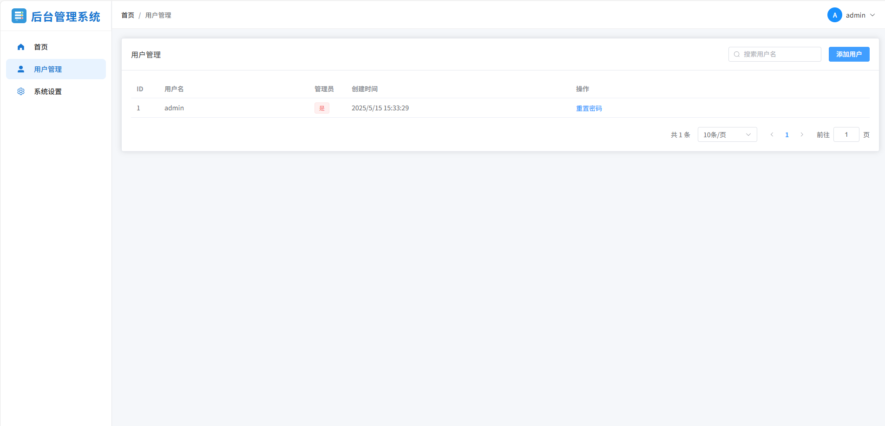

# 后台管理系统

一个基于 Go + Vue 3 的后台管理系统，支持用户注册、登录、密码修改等功能。

## 界面预览





## 功能特点

- 用户认证（登录、注册、登出）
- 用户信息管理（修改密码）
- 管理员功能（用户管理、重置密码）
- 响应式界面设计
- 基于 JWT 的身份验证
- SQLite 数据存储

## 技术栈

### 后端
- Go 1.21
- Gin Web 框架
- SQLite 数据库
- JWT 认证

### 前端
- Vue 3
- Element Plus UI 框架
- Pinia 状态管理
- Vue Router

## 快速开始

### 使用 Docker 运行

1. 确保已安装 Docker 和 Docker Compose
2. 克隆项目到本地
3. 在项目根目录运行：

```bash
docker-compose up -d
```

4. 访问 http://localhost:9876

### 默认管理员账户

- 用户名：admin
- 密码：admin

## 开发环境设置

### 后端开发

1. 进入后端目录：
```bash
cd backend
```

2. 安装依赖：
```bash
go mod download
```

3. 运行开发服务器：
```bash
go run main.go
```

### 前端开发

1. 进入前端目录：
```bash
cd frontend
```

2. 安装依赖：
```bash
npm install
```

3. 运行开发服务器：
```bash
npm run dev
```

## 配置说明

可以通过环境变量或配置文件修改以下设置：

- `SERVER_ADDRESS`: 服务器监听地址（默认：:8080）
- `JWT_SECRET`: JWT 密钥
- `DATA_PATH`: 数据库文件路径

## 许可证

MIT 